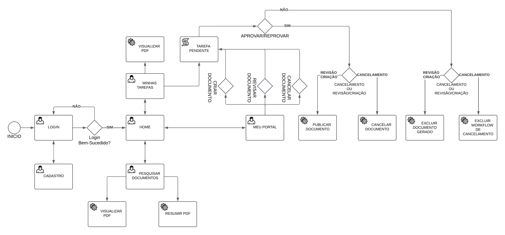

# Sistema de Gestão Eletrônica de Documentos (GED)

Este projeto é o meu portfólio de TCC para o curso de Engenharia de Software, desenvolvido durante a 8ª fase do curso. O sistema GED (Gestão Eletrônica de Documentos) tem como objetivo facilitar a organização, controle e gestão eficiente de documentos eletrônicos em uma organização.

## Motivação

A escolha do GED como tema de projeto foi baseada em:
- **Interesse pessoal**: Tenho grande interesse por tecnologias de informação e organização de dados, e o desenvolvimento deste sistema me permite aprofundar esses conhecimentos.
- **Desenvolvimento de competências**: O projeto abrange o aprendizado de novas tecnologias, frameworks web e metodologias ágeis.
- **Relevância do tema**: A gestão de documentos é essencial para qualquer organização, proporcionando maior controle, segurança e redução de custos operacionais.

## Diagrama de Fluxo de Processo

## Funcionalidades Principais

1. **Criação de documentos**: Suporta formatos como PDF além de controle de versão e categorização.
2. **Revisão de documentos**: Workflow de aprovação, histórico de alterações e controle de status.
3. **Cancelamento de documentos**: Justificativas e processo de cancelamento de documentos obsoletos.
4. **Controle de status**: Acompanhamento em tempo real dos status dos documentos (criação, revisão, cancelamento).
5. **Pesquisa de documentos**: Busca avançada utilizando Elasticsearch com filtros por categoria, data, status e palavras-chave (em desenvolvimento).

## Tecnologias Utilizadas

- **Front-end**: HTML + CSS + vueJS/JavaScript
- **Back-end**: Python com Flask (API RESTful)
- **Banco de Dados**: MySQL Workbench
- **Pesquisa de documentos**: MySQL + Elasticsearch (em desenvolvimento)

## Arquitetura

O sistema é dividido em três principais componentes:
- **Interface do usuário**: Interface amigável desenvolvida em HTML + CSS e vueJS/JavaScript.
- **API RESTful**: Desenvolvida com Python/Flask, responsável por gerenciar documentos, banco de dados, processos e usuários.
- **Banco de dados**: Utiliza MySQL para armazenar os documentos e metadados, com suporte ao Elasticsearch para indexação de documentos (em desenvolvimento).

## Cronograma de Desenvolvimento

O desenvolvimento foi dividido nas seguintes fases:

1. **Levantamento de Requisitos** (4 semanas): Definição dos objetivos, levantamento de requisitos, protótipos e arquitetura.
2. **Planejamento e Design da Arquitetura** (6 semanas): Detalhamento da arquitetura, modelo de dados, protótipos e plano de segurança.
3. **Desenvolvimento** (12 semanas): Implementação da interface, API e banco de dados, além da integração com Elasticsearch.
4. **Testes e Finalização** (4 semanas): Testes de usabilidade, correções e entrega final.

## Recursos Necessários

- **Hardware**: Computador com processador Intel Core i3 ou superior, 8GB de RAM e 50GB de espaço em disco.
- **Software**: Python 3.9+, Flask, VueJS, MySQL Workbench, Elasticsearch.

## Dependências

- **requirements.txt**: Para executar o projeto, você precisa ter instalado as dependências que estão no requirements.txt do projeto. Para isso, digite: pip install -r requirements.txt
- **ElasticSearch**: Certifique-se de que o Elasticsearch está instalado e em execução localmente na porta 9200.
- **JDBC Driver**: O projeto utiliza o driver JDBC para conectar ao MySQL. Você deve ter o mysql-connector-java instalado. A configuração está no arquivo: mysql_to_elasticsearch.conf
- **Logstash**: Para realizar a integração entre o MySQL e o Elasticsearch, você precisará do Logstash. A configuração está no arquivo: mysql_to_elasticsearch.conf

## Inicializar projeto

1. **Inicializar o MYSQL**: Incializar o servidor no MYSQL workbench
2. **Inicializar Aplicação Flask**: python app.py

## Considerações Finais

O Sistema de Gestão Eletrônica de Documentos (GED) é uma ferramenta essencial para a gestão eficiente de documentos em qualquer organização. Este projeto representa uma excelente oportunidade de aprimorar minhas habilidades técnicas e contribuir com soluções práticas para problemas organizacionais.

Em uma futura oportunidade, implementar mais funcionalidades e com foco maior em segurança (permissões) e criação de fluxogramas personalizados.

## Autor

**Lucas Josué Schneider**  
Curso de Engenharia de Software, 8ª fase - noturno.

